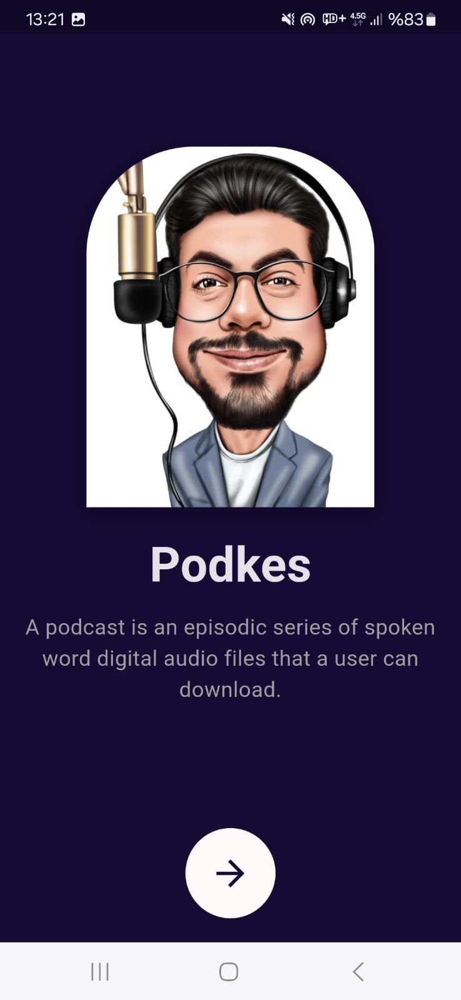
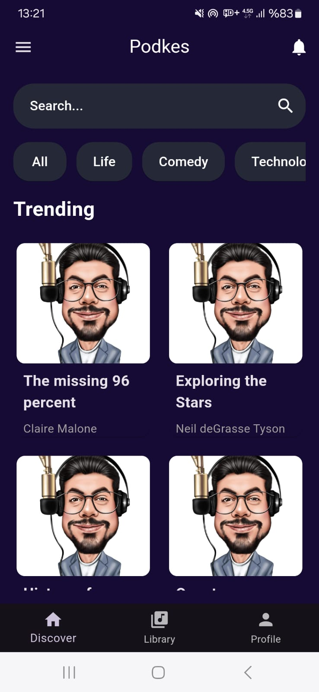
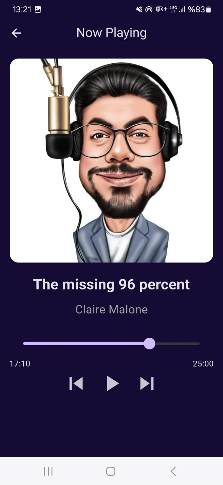

# Podkes 🎧

**Podkes** modern bir podcast keşif ve dinleme uygulamasıdır. Kullanıcı dostu tasarımı ve karanlık temasıyla, farklı kategorilerdeki popüler podcast'leri keşfetmenize ve dinlemenize olanak tanır.

## Ekran Görüntüleri

### Yerleşik Ekran

### Ana Ekran

### Şimdi Çalıyor

## 🚀 Özellikler

- 🎙️ Podcast keşfi: Farklı kategorilerdeki podcast'leri keşfedin.
- 🕶️ Karanlık Tema: Kullanıcı dostu, göz yormayan bir tasarım.
- 📱 Responsive Tasarım: Farklı cihazlarda mükemmel uyum.
- 🔍 Arama Fonksiyonu: Aradığınız içeriklere kolayca ulaşın.
- 📂 Modüler Yapı: Kolay anlaşılabilir, temiz kod.

## 📂 Proje Yapısı

- /lib
 -  ├── models/          # Veri modelleri (Podcast gibi)
 -  ├── screens/         # Uygulama ekranları (Home, NowPlaying)
 -  ├── services/        # API ve veri işlemleri
 -  ├── widgets/         # Tekrarlı bileşenler (CustomBottomNavbar, PodcastCard gibi)
 -  └── main.dart        # Ana dosya

🛠️ Kullanılan Teknolojiler
- Flutter: Modern mobil uygulama geliştirme için.
- Dart: Flutter ile uyumlu bir programlama dili.
- API Entegrasyonu: Podcast verilerini dinamik olarak getirmek için.

🚀 Başlatma
Bu projeyi yerel ortamınızda çalıştırmak için aşağıdaki adımları izleyin:
1. Bu depoyu klonlayın:
git clone https://github.com/kilicarslanokan/podkes.git
2. Gerekli bağımlılıkları yükleyin:
flutter pub get
3. Projeyi çalıştırın:
flutter run

📧 İletişim
Eğer bu proje hakkında sorularınız varsa, benimle iletişime geçmekten çekinmeyin:

- Email: okan.kilicarslan9@gmail.com
- GitHub: https://github.com/kilicarslanokan

Uygulamayı beğendiyseniz bu projeyi yıldızlamayı unutmayın ⭐! 😊
